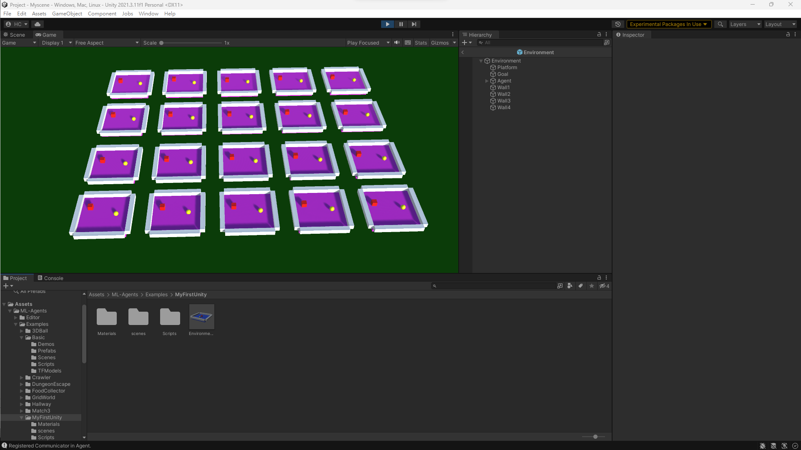

# Unity MLAgents
---
I am currently learning how to use Unity MLAgents. 
---
## PROJECTS
### MyFirstUnity 
This is my first unity mlagents learning from [Code Monkeys](https://www.youtube.com/watch?v=zPFU30tbyKs).  
In this project, a box is trained to touch the goal. Starting at the same position every episode currently.
